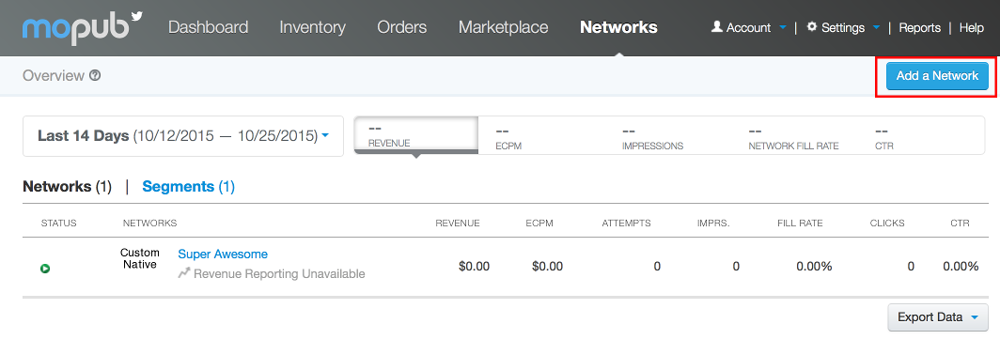
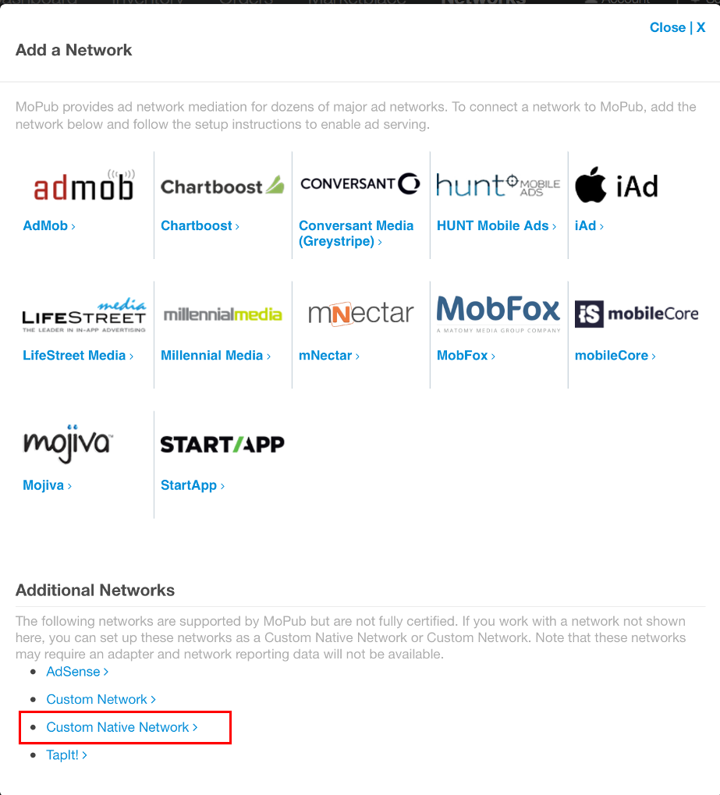
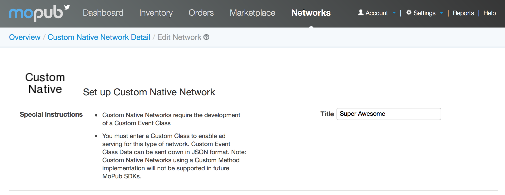
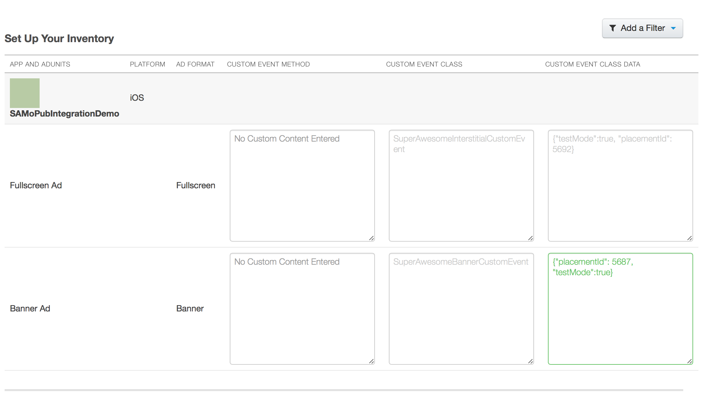

If you already have MoPub ads serving in your app, but want to integrate SuperAwesome as well, without having to directly use the AwesomeAds SDK, you can follow the steps below:

#### Integrate the SDK

The first thing you should do is integrate the SDK in your current app by following the instructions in [Getting Started / Integrating the SDK](https://developers.superawesome.tv/docs/iossdk/Getting%20Started/Integrating%20the%20SDK?version=3).

This will add the SDK to your current project. 

#### Download Adapters

Next, you'll need to download a list of files called Adapters:

  * [SuperAwesomeBannerCustomEvent.h](https://raw.githubusercontent.com/SuperAwesomeLTD/sa-mobile-sdk-ios/develop_v3/SuperAwesome/MoPubIntegration/SuperAwesomeBannerCustomEvent.h)
  * [SuperAwesomeBannerCustomEvent.m](https://raw.githubusercontent.com/SuperAwesomeLTD/sa-mobile-sdk-ios/develop_v3/SuperAwesome/MoPubIntegration/SuperAwesomeBannerCustomEvent.m)
  * [SuperAwesomeInterstitialCustomEvent.h](https://raw.githubusercontent.com/SuperAwesomeLTD/sa-mobile-sdk-ios/develop_v3/SuperAwesome/MoPubIntegration/SuperAwesomeInterstitialCustomEvent.h)
  * [SuperAwesomeInterstitialCustomEvent.m](https://raw.githubusercontent.com/SuperAwesomeLTD/sa-mobile-sdk-ios/develop_v3/SuperAwesome/MoPubIntegration/SuperAwesomeInterstitialCustomEvent.m)

These will act as a convenient bridge between SuperAwesome and MoPub, so that you don't have to write any aditional line of code.

#### Setup a MoPub Custom Network

From your MoPub admin interface you should create a `New Network`



Form the next menu, select `Custom Native Network`



You'll be taken to a new page. Here select the title of the new network



And assign custom inventory details for Banner and Interstitial ads:



Custom Event Class is:
  * for Banner Ads: `SuperAwesomeBannerCustomEvent`
  * for Interstitial Ads: `SuperAwesomeInterstitialCustomEvent`

Notice these are identical to the names of the four files you downloaded in step one.

Custom Event Data is always required, and must be given in the form of  JSON:

```
{
	"placementId": 5692,
	"testMode": true,
	"parentalGateEnabled": true
}

```

If you don't yet have a Placement ID for Awesome Ads, check out the [Getting Started / Registering Your App on the Dashboard](https://developers.superawesome.tv/docs/iossdk/Getting%20Started/Registering%20Your%20App%20on%20the%20Dashboard?version=3) section.
